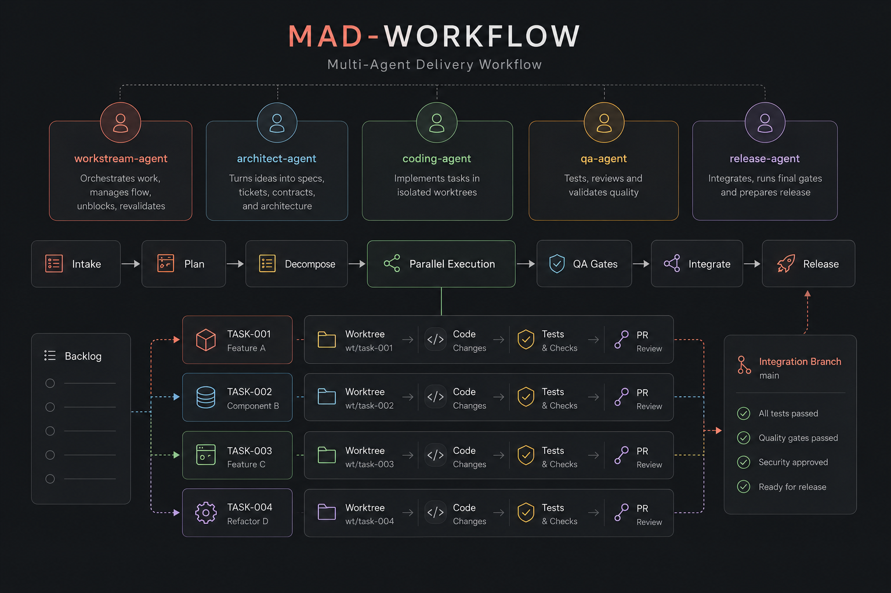
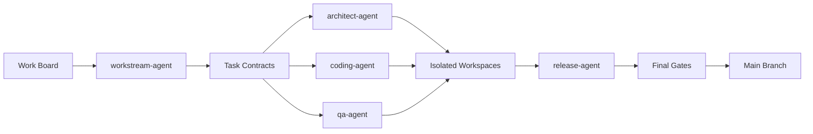
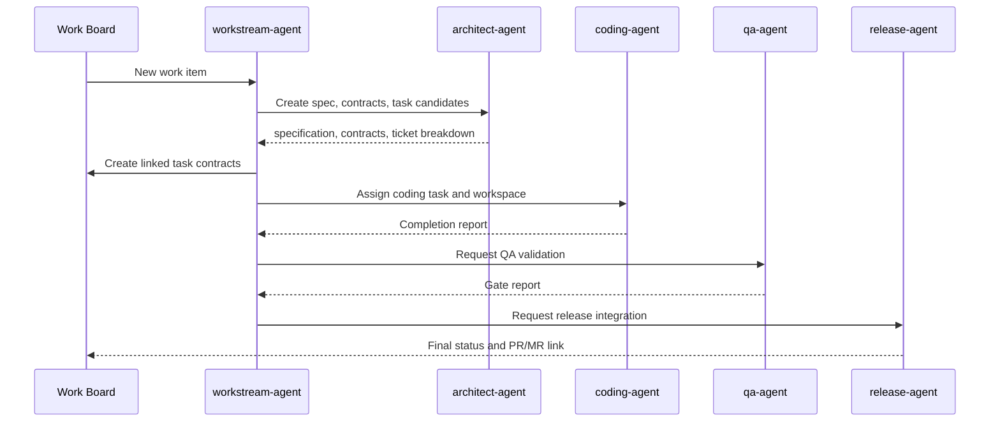

# MAD Workflow - Multi Agent Delivery Workflow



This repo defines a lean operating model for multiple AI agents working on one codebase without losing delivery control.

The model is intentionally small:

- 5 durable agent profiles
- 10 reusable skills
- 1 shared work board
- 1 repository workspace model
- 1 task contract format
- 1 quality gate model

It is tool-agnostic. The work board can be any Kanban or ticketing system. The repository can be hosted anywhere. The agents can run in any runtime that supports file access, terminal access, Git, and task execution.

## Core idea

Agents should not share one mutable checkout. Each task gets its own isolated workspace and branch. The board tracks work. Contracts define integration boundaries. QA gates decide whether work may proceed. The release-agent integrates only validated branches.



## Five-agent model

| Agent | Primary accountability |
|---|---|
| `workstream-agent` | Own the board, task breakdown, dependencies, execution waves, blockers, and revalidation. |
| `architect-agent` | Turn intent into specifications, tickets, contracts, interface rules, and design constraints. |
| `coding-agent` | Build assigned work in an isolated workspace. Handles backend, frontend, mobile, infra, data, or tooling based on the task contract. |
| `qa-agent` | Test and review work. Validate quality, security, accessibility, performance, design-system compliance, and contract impact. |
| `release-agent` | Merge completed branches into an integration branch, run final gates, prepare the final PR/MR, and maintain traceability. |

## Skill set

| Skill | Purpose |
|---|---|
| `workstream-management` | Coordinate the end-to-end multi-agent delivery flow. |
| `spec-and-ticket-decomposition` | Convert input into specification and board-ready tickets. |
| `task-contracts` | Create strict work packets for agents. |
| `repository-workspaces` | Enforce one task, one branch, one isolated workspace. |
| `contracts-and-interfaces` | Keep shared contracts stable and dependency-aware. |
| `coding-standards` | Guide safe code changes across backend, frontend, mobile, infra, and data tasks. |
| `frontend-design-system` | Apply UI, design-system, accessibility, responsive, and interaction-state rules. |
| `testing-and-quality-gates` | Define test scope, review checks, and gate decisions. |
| `change-impact-analysis` | Detect changed artifacts and affected dependent tasks. |
| `completion-and-handoff` | Standardize completion, blocker, and handoff reports. |

## Workflow



## Recommended repository layout

```text
repo/
  main-checkout/
  worktrees/
    TASK-001-architecture/
    TASK-002-coding/
    TASK-003-qa/
  .agents/
    plan.yaml
    dependency-graph.json
    task-contracts/
    reports/
```

## Operating rules

1. One task equals one owner, one branch, one isolated workspace.
2. Shared contracts are changed deliberately and trigger impact analysis.
3. The board is the single source of work status.
4. Coding starts only from a task contract.
5. QA gates decide readiness, not agent confidence.
6. Human review remains required for final merge or policy exceptions.

## External skills

If available, the workstream-agent or architect-agent may reuse external skills such as `to-spec` and `to-tickets`. This repo contains fallback rules so it remains usable without those skills.


## Runtime metadata

Each skill contains `agents/openai.yaml` with concise, complete title/description metadata. The wording is intentionally usable in Hermes Agent, OpenCode, and other coding-agent runtimes. Individual skill ZIPs also include `agents/runtime.yaml` as optional neutral metadata.
